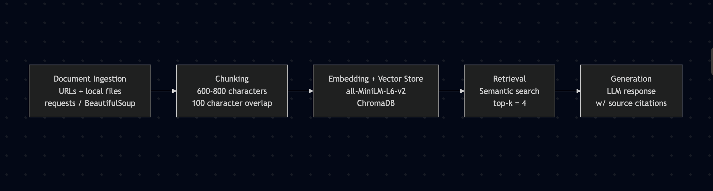

# Project 1 Planning: The Unofficial Guide

> Write this document before you write any pipeline code.
> Your spec and architecture diagram are what you'll use to direct AI tools (Claude, Copilot, etc.) to generate your implementation — the more specific they are, the more useful the generated code will be.
> Update the Retrieval Approach and Chunking Strategy sections if you change your approach during implementation.
> Update this file before starting any stretch features.

---

## Domain

<!-- What domain did you choose? Why is this knowledge valuable and hard to find through official channels? -->

The domain for this project is an unofficial Amherst College student survival guide that combines information about academics, dining, campus life, student experiences, and social culture. While Amherst provides extensive official resources, many practical questions students have—such as what campus life is really like, how students feel about dining options, or how to navigate social and academic challenges—are answered through scattered blogs, student discussions, and community forums. This brings together those perspectives into a searchable knowledge base that reflects both institutional information and authentic student experiences.

---

## Documents

<!-- List your specific sources: URLs, subreddit names, forum threads, or file descriptions.
     Aim for at least 10 sources that together cover different subtopics or perspectives within your domain. -->

| # | Source | Description | URL or location |
|---|--------|-------------|-----------------|
| 1 | Amherst Student Blog | Survival Guide for First Years | https://amherststudent.com/article/the-first-years-survival-guide/ | 
| 2 | Reddit | Reddit thread of student life | https://www.reddit.com/r/amherstcollege/comments/1r2pfbm/amherst_student_life/ |
| 3 | Official Amherst College website | Information about AC Dining | https://www.amherst.edu/campuslife/housing-dining/dining/about-ac-dining/meal_plans_2025-2026 |
| 4 | Blog | Blog article of an AC guide | https://www.collegekidguide.com/home-1/blog-post-title-three-9c5lk |
| 5 | Official AC Website | FAQ of Dining Plans/Info | https://www.amherst.edu/campuslife/housing-dining/dining/about-ac-dining/faq |
| 6 | Official AC Website | Academic information | https://www.amherst.edu/academiclife/support |
| 7 | Official AC Website | Campus Life information | https://www.amherst.edu/campuslife |
| 8 | Niche polls site | Student Polls about campus life | https://www.niche.com/colleges/amherst-college/campus-life/ |
| 9 | Amherst Student blog | About community/social life in AC | https://amherststudent.com/article/the-anguish-of-amherst-college-students/ |
| 10 | Bigfuture College Site | Student and campus details about AC | https://bigfuture.collegeboard.org/colleges/amherst-college/campus-life |

---

## Chunking Strategy

<!-- How will you split documents into chunks?
     State your chunk size (in tokens or characters), overlap size, and explain why those
     numbers fit the structure of your documents.
     A review-heavy corpus warrants different chunking than a long FAQ. -->

**Chunk size:**

600–800 characters

**Overlap:**

around 100 characters

**Reasoning:**

The chunks makes sense because many of my sources are medium-length web pages, blog posts, FAQs, and student comments. The chunks should be large enough to preserve context like a full FAQ answer, but small enough that retrieval can return focused evidence.
The overlap is useful because some important details may appear across paragraph boundaries especially in guides/FAQ pages.

---

## Retrieval Approach

<!-- Which embedding model are you using (e.g., all-MiniLM-L6-v2 via sentence-transformers)?
     How many chunks will you retrieve per query (top-k)?
     If you were deploying this for real users and cost wasn't a constraint, what tradeoffs
     would you weigh in choosing a different embedding model — context length, multilingual
     support, accuracy on domain-specific text, latency? -->

**Embedding model:**

all-MiniLM-L6-v2 from sentence-transformers

**Top-k:**

4

**Production tradeoff reflection:**

I would consider using a larger + higher-accuracy embedding model if cost was not a constraint. I would weigh tradeoffs such as longer context length, better handling of informal student language, and perhaps a stronger performance on domain-specific campus terms. A larger model might improve retrieval quality, but it could also make the system slower and more expensive to run.

---

## Evaluation Plan

<!-- List your 5 test questions with their expected correct answers.
     Questions should be specific enough that you can judge whether the system's response
     is right or wrong. "What are good dining halls?" is too vague.
     "What do students say about wait times at [dining hall name] during lunch?" is testable. -->

| # | Question | Expected answer |
|---|----------|-----------------|
| 1 | What academic support resources does Amherst list for students? | Should cite Amherst’s academic support page and mention the writing center, the strategic learning center, Frost Library resources, etc  |
| 2 | What do students say about Amherst social life or campus community? | Students report that Amherst's social life is heavily clique-based, with limited interaction between groups, occasional feelings of isolation, and a strong work-hard/play-hard culture centered around parties and campus traditions.|
| 3 | What advice do students give incoming, first-year students at Amherst? | They recommend that first-years embrace new experiences, take advantage of campus resources, make diverse social connections, communicate with professors, and get involved in the campus community.|
| 4 | How do meal plans work at the Amherst College dining hall? | First-year students receive the Unlimited meal plan, which allows unlimited Dining Hall access using an Amherst ID card or mobile app. Meal swipes can also be used at Keefe Grab and Go, and students can manage balances through the Mammoth Mobile App.|
| 5 | What do students say about things to do in Amherst town? | Students say Amherst offers lots of restaurants, cafes, bars, shopping areas, outdoor activities, and campus events. Popular places to hang/visit include downtown Amherst, Route 9, Northampton, local hiking trails, Puffer's Pond, and the Norwottuck Rail Trail. |

---

## Anticipated Challenges

<!-- What could go wrong? Name at least two specific risks with reasoning.
     Consider: noisy or inconsistent documents, missing source attribution, off-topic
     retrieval, chunks that split key information across boundaries. -->

1. The sources mix official Amherst information with subjective student opinions. The system may accidentally present Reddit, blog, or Niche comments as official facts.

2.Some documents may be noisy, broad, or inconsistent. For example, “campus life” appears across many pages, so retrieval could return off-topic chunks unless chunks are focused and metadata is preserved.

---

## Architecture

<!-- Draw a diagram of your pipeline showing the five stages:
     Document Ingestion → Chunking → Embedding + Vector Store → Retrieval → Generation
     Label each stage with the tool or library you're using.
     You can use ASCII art, a Mermaid diagram, or embed a sketch as an image.
     You'll use this diagram as context when prompting AI tools to implement each stage. -->

---

## AI Tool Plan

<!-- For each part of the pipeline below, describe:
     - Which AI tool you plan to use (Claude, Copilot, ChatGPT, etc.)
     - What you'll give it as input (which sections of this planning.md, which requirements)
     - What you expect it to produce
     - How you'll verify the output matches your spec

     "I'll use AI to help me code" is not a plan.
     "I'll give Claude my Chunking Strategy section and ask it to implement chunk_text()
     with my specified chunk size and overlap" is a plan. -->

**Milestone 3 — Ingestion and chunking:**
I plan to give Claude my Documents section, Chunking Strategy section, and Milestone 3 requirements and I expect it to produce code that loads text from my URLs/local files, cleans the text, preserves source metadata, and splits each document into 600–800 character chunks and 100 characters of overlap. I will verify the output by printing sample chunks and checking that each chunk has the correct source title, URL, and chunk index.

**Milestone 4 — Embedding and retrieval:**
I plan to give Claude my retrieval requirements and ask it to generate code that creates embeddings, stores them, and retrieves the top 4 most relevant chunks for a query. I'll verify that it's working by running my evaluation questions and seeing whether the retrieved chunks come from the sources I would expect.

**Milestone 5 — Generation and interface:**
I'll provide my architecture diagram and evaluation plan to Claude, and ask it to generate code that takes a user's question, retrieves relevant chunks, and uses them to generate an answer with source citations. I'll check that the answers are actually supported by the retrieved documents and that the citations point to the correct sources.